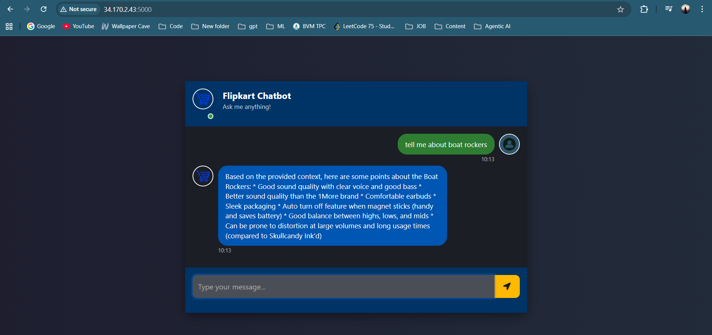
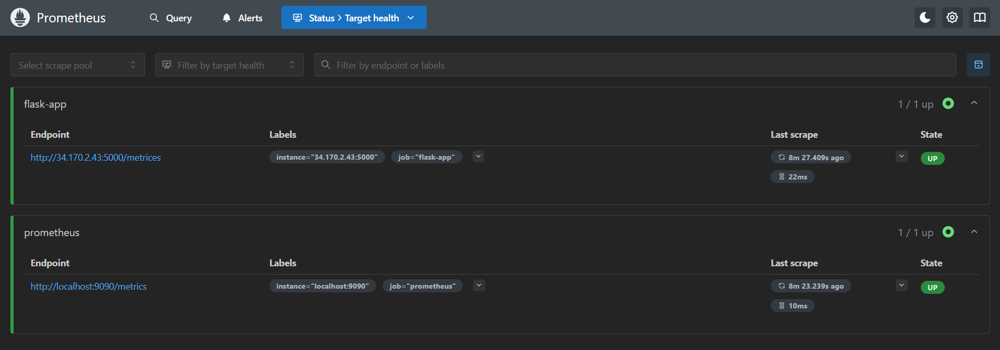
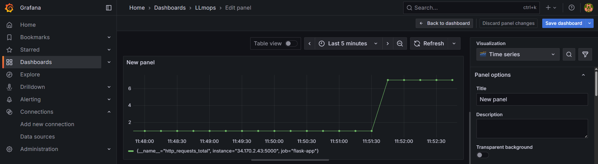

# Flipkart Product Recommender (LLM + RAG) with MLOps, Docker, Kubernetes, and Monitoring

A production-oriented Flask application that serves a Flipkart product Q&A/recommendation interface powered by a Retrieval-Augmented Generation (RAG) pipeline. The project includes:

- End-to-end app with Flask UI and form-based chat.
- RAG pipeline using `langchain`, vector store, and model integrations.
- Containerization with Docker.
- Kubernetes deployment manifests suitable for Minikube/local clusters.
- Observability with Prometheus metrics and Grafana dashboards.

This README consolidates all setup, deployment, and monitoring instructions based on the repository and the provided full documentation.


## Features
- **RAG-based Recommendations** using `langchain` components.
- **Web UI** served via Flask (`templates/index.html`, `static/style.css`).
- **Metrics** exposed for Prometheus at `GET /metrices` (as spelled in code).
- **Containerized** via Docker with `python:3.10-slim` base.
- **Kubernetes Manifests** for Deployment + Service (LoadBalancer) in `flask-deployment.yaml`.
- **Prometheus & Grafana** manifests and Helm-based instructions for cluster monitoring.


## Screenshots / Demo

UI Preview



Prometheus Metrics Endpoint (scraped by Prometheus)



Grafana Monitoring Dashboard




## Repository Structure
- **app.py** — Flask app entrypoint and routes (`/`, `/get` [POST], `/metrices`).
- **flipkart/** — Package with RAG chain (`rag_chain.py`) and data ingestion (`data_ingestion.py`).
- **templates/index.html** — Frontend UI template.
- **static/style.css** — Styles for UI.
- **data/** — Project data directory (place your corpus/artifacts here as needed).
- **Dockerfile** — Container build instructions.
- **flask-deployment.yaml** — Kubernetes Deployment + Service for the Flask app.
- **prometheus/** — Prometheus configmap and deployment manifests.
- **grafana/grafana-deployment.yaml** — Grafana manifest (if not using Helm charts).
- **requirements.txt** — Python dependencies.
- **setup.py** — Editable package installation for `flipkart` module.
- **.env** — Environment variables (create locally; not committed).


## Tech Stack
- Python 3.10
- Flask 3.x
- LangChain (core, community, groq, huggingface, astrapdb)
- AstraDB
- Prometheus client for Python
- Docker
- Kubernetes (Minikube local recommended)
- Grafana + Prometheus for observability

Dependency pins are in `requirements.txt`.


## Application Overview
The Flask app wires together the vector store and `langchain` chain once on startup.

- On startup, `DataIngestor().ingest(load_existing=True)` is called to load/build a vector store.
- `RAGChainBuilder(vectorstore).build_chain()` constructs the retrieval-augmented chain.
- Routes:
  - `/` — Returns the UI.
  - `/get` — Accepts `POST` form data with field `msg` and returns the model answer (string).
  - `/metrices` — Exposes Prometheus metrics (note the spelling in code).


## Prerequisites
- Python 3.10+
- (Optional) A virtual environment (recommended)
- Docker Desktop (for container builds) if using Docker
- Minikube + kubectl + Helm (for Kubernetes + monitoring)


## Environment Variables
Create a `.env` file in the project root with required secrets (these are referenced in Kubernetes as well):

- `GROQ_API_KEY`
- `HUGGINGFACEHUB_API_TOKEN`

Example `.env` (placeholders):

```
GROQ_API_KEY=your_groq_key
HUGGINGFACEHUB_API_TOKEN=your_hf_token
```


## Local Development
1. Create and activate a virtual environment.
2. Install in editable mode (ensures the `flipkart` package is available):

```
pip install --upgrade pip
pip install -r requirements.txt
pip install -e .
```

3. Ensure data needed by `DataIngestor` exists under `data/` as expected by your ingestion code.
4. Run the app:

```
python app.py
```

5. Open http://localhost:5000

Endpoints:
- `GET /` — UI page
- `POST /get` — Form field `msg`, returns answer string
- `GET /metrices` — Prometheus metrics


## Docker
Build and run the image locally:

```
docker build -t flask-app:latest .
docker run --env-file .env -p 5000:5000 flask-app:latest
```

Open http://localhost:5000.


## Kubernetes (Minikube)
You can run the app locally on Minikube. Two options for building the image:

- Build inside Minikube’s Docker daemon (Linux/macOS):
  - `eval $(minikube docker-env)`
  - `docker build -t flask-app:latest .`

- Build on host and then push to a registry accessible by the cluster (not covered here).

Windows PowerShell equivalent for using Minikube’s Docker daemon:

```
minikube -p minikube docker-env | Invoke-Expression
```

Apply secrets and deploy:

```
# Create Kubernetes Secret for app env
kubectl create secret generic llmops-secrets \
  --from-literal=GROQ_API_KEY="" \
  --from-literal=HUGGINGFACEHUB_API_TOKEN=""

# Deploy app (Deployment + Service)
kubectl apply -f flask-deployment.yaml

# Check resources
kubectl get pods
kubectl get svc
```

Expose and access the app:
- If using Service type LoadBalancer with Minikube, you can run `minikube tunnel` in a separate terminal to allocate an external IP.
- Alternatively, use port-forwarding:

```
kubectl port-forward svc/flask-service 8501:80 --address 0.0.0.0
```

Then open http://127.0.0.1:8501

Note: In your earlier docs you may see `llmops-k8s.yaml`. This repository ships `flask-deployment.yaml`. Use the one present in this repo.


## Observability: Prometheus + Grafana
The app exports Prometheus metrics at `GET /metrices`.

### Prometheus
Manifests provided under `prometheus/`:
- `prometheus-configmap.yaml`
- `prometheus-deployment.yaml`

Typical steps:
```
kubectl create ns monitoring
kubectl apply -n monitoring -f prometheus/prometheus-configmap.yaml
kubectl apply -n monitoring -f prometheus/prometheus-deployment.yaml
kubectl get pods -n monitoring
```
Configure the scrape job in the ConfigMap so Prometheus scrapes your Flask Service (ClusterIP/LoadBalancer) at port 5000 target or Service port 80 depending on your setup.

### Grafana
Two approaches:
- Use the provided `grafana/grafana-deployment.yaml` as a starting point.
- Or use Grafana Cloud with Helm charts (recommended), as per your full documentation.

Helm-based (high level):
- Create a Grafana Cloud account.
- Generate an access token and keep it safely.
- Use the Helm chart from Grafana’s repo with a custom `values.yaml` you create based on the instructions generated in Grafana Cloud.

Example flow (pseudocode; follow the values from your Grafana Cloud page):
```
helm repo add grafana https://grafana.github.io/helm-charts
helm repo update
helm upgrade --install --atomic --timeout 300s grafana-k8s-monitoring grafana/k8s-monitoring \
  --namespace monitoring --create-namespace --values values.yaml
```
Check:
```
kubectl get pods -n monitoring
```
Once running, log in to Grafana, add Prometheus as a data source (if not already wired by the chart), and explore dashboards for Kubernetes and your app.


## Notes and Tips
- Ensure `.env` values are set both locally and in Kubernetes Secrets.
- The `/metrices` route name is intentional (matches code). If you prefer `/metrics`, update `app.py` accordingly and re-deploy.
- If the vector store isn’t present yet, the first run may take longer due to ingestion.
- For Minikube LoadBalancer Services, remember to run `minikube tunnel`.
- On Windows, prefer PowerShell equivalents for shell commands.


## Troubleshooting
- Pod stuck in ImagePullBackOff: build/push image where cluster can pull it, or build with Minikube’s Docker daemon.
- 404 on metrics: confirm you’re hitting `/metrices` and that the app is reachable in-cluster.
- Empty answers: verify API keys and that your `data/` content matches what `DataIngestor` expects.
- Prometheus not scraping: check Service name/ports and scrape config in the ConfigMap.

## Acknowledgements
- LangChain, AstraDB
- Prometheus, Grafana
- Kubernetes, Minikube
